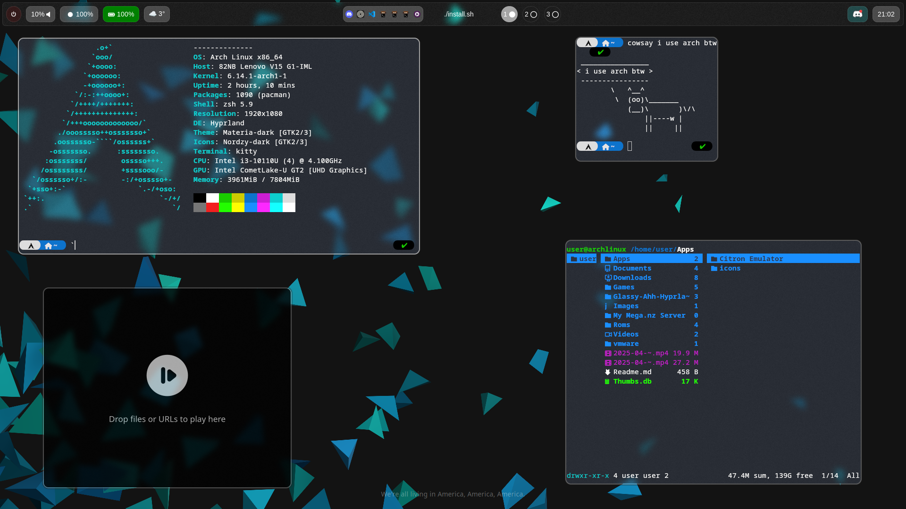
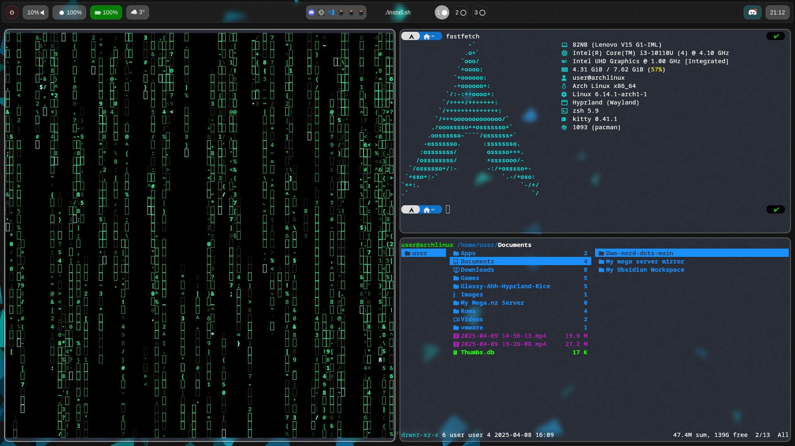
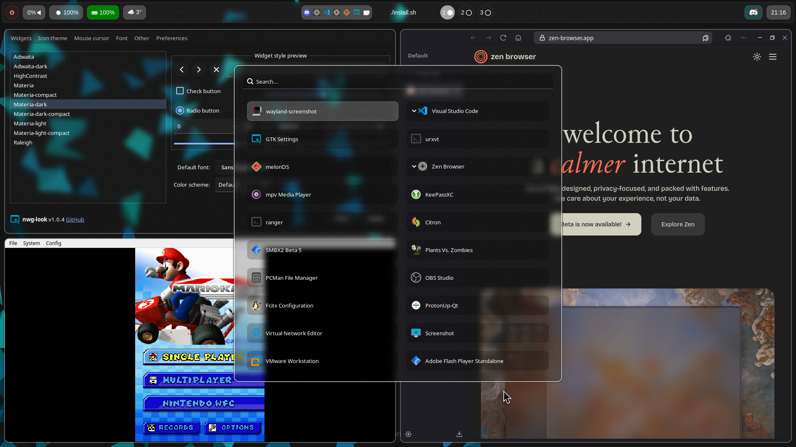

# Welcome to my Dotfiles repository!
Here i have dotfiles of my Linux rices i have been done so far free free to check out or to install a specific rice!

# Rices
### Glassy Ahh Hyprland
<a href="resources/screenshots/GlassyAhhRice.png">

Beautiful clean glassmorphic blurry looking Hyprland rice that took me over 3 days to make

### Features
- Clean
- Has background blur and noises
- Glasmorphic looking Waybar
- Glasmorphic looking Wofi launcher
- Uses ONLY 722mb of Ram!
- Has custom pop-in pop-out animation!

### Installation

Just use the following command to install directly no fuss needed!

### Direct install
`"sh -c $(curl -fsSL https://raw.githubusercontent.com/1nhp/dotfiles/refs/heads/main/GlassyAhhHyprlandRice/install.sh)"`

or you can try copying the config files yourself manually

> # NOTE
>  That the rice is still not finished aswell as the install scripts so you may find bugs if you do pls report them in the issues section
